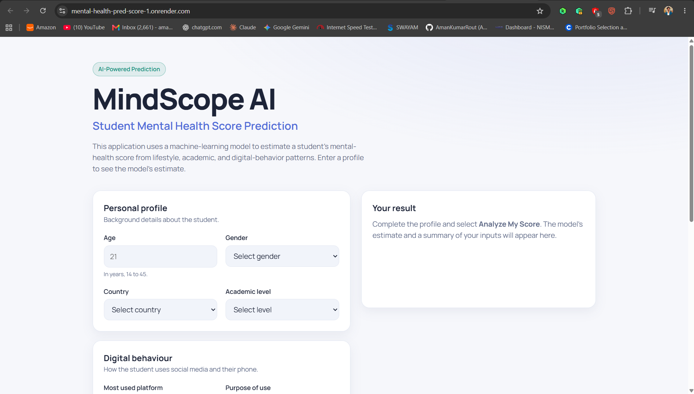
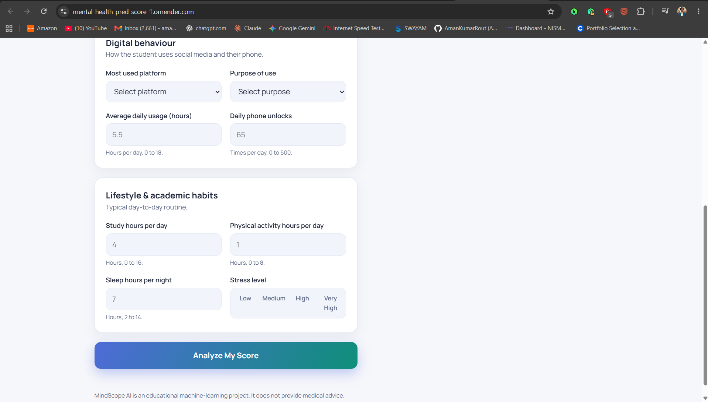
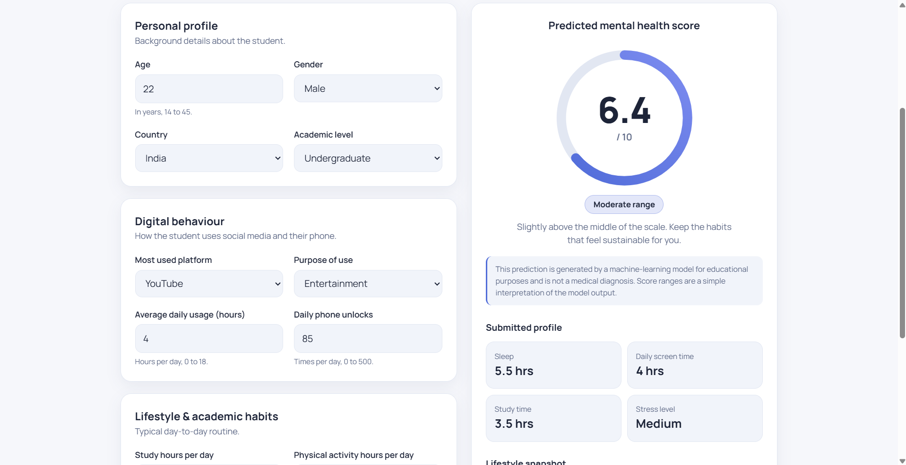

# 🧠 Mental Health Prediction Score

> An end-to-end Machine Learning project that predicts a student's **Mental Health Score (0–10)** from academic, lifestyle, social-media and behavioural factors, and serves the trained ML model through a **FastAPI REST API** with a deployed web interface.

🚀 **Live Demo:** `https://mental-health-pred-score-1.onrender.com/`

🔗 **Backend API:** `https://mental-health-pred-score.onrender.com/`










---

## 📌 What Does This Project Do?

**Mental Health Prediction Score** is a Machine Learning web application designed to estimate a student's mental health score based on a combination of:

- 👤 Demographic information
- 🎓 Academic level
- 📱 Social-media usage
- 🔓 Daily phone unlocks
- 📚 Study hours
- 🏃 Physical activity
- 😴 Sleep duration
- 😰 Stress level
- 🌐 Country
- 📲 Most-used social-media platform
- 🎯 Purpose of social-media usage

The user enters these details through the web interface.

The data is then sent to a **FastAPI backend**, where the trained Machine Learning pipeline processes the input and generates a predicted score.

```text
User Input
    ↓
Frontend
    ↓
HTTP POST Request
    ↓
FastAPI API
    ↓
Input Validation with Pydantic
    ↓
Feature Preparation
    ↓
Saved ML Pipeline
    ↓
Random Forest Regressor
    ↓
Predicted Mental Health Score
    ↓
JSON Response
    ↓
Frontend Result
```

⚠️ **Important:** This project is an educational Machine Learning application. The predicted score is a model estimate and **is not a medical diagnosis or professional mental-health assessment.**

---

# 🎯 Project Objective

The main objective of this project was not only to train a Machine Learning model, but to understand how a complete ML application works from **raw data to a deployed prediction system**.

The project covers:

1. 📊 Data exploration
2. 🧹 Data preprocessing
3. 🔎 Outlier analysis
4. 🛠️ Feature engineering
5. 🔀 Train-test splitting
6. ⚙️ Building preprocessing pipelines
7. 🤖 Training multiple ML models
8. 📈 Evaluating model performance
9. 🎛️ Hyperparameter tuning
10. 💾 Saving the ML pipeline
11. 🚀 Building an API using FastAPI
12. 🔗 Connecting the frontend with the API
13. 🌐 Deploying the application

---

# 📂 Dataset

The project uses the **Student Social Media and Mental Health Impact** dataset.

The dataset contains:

- **5,000 records**
- **13 original features**

Some important columns include:

| Feature | Description |
|---|---|
| `Age` | Student's age |
| `Gender` | Gender |
| `Country` | Student's country |
| `Academic_Level` | High School / Undergraduate / Graduate |
| `Most_Used_Platform` | Most-used social media platform |
| `Purpose_Of_Use` | Main purpose of social-media usage |
| `Avg_Daily_Usage_Hours` | Average daily social-media usage |
| `Daily_Unlocks` | Number of phone unlocks per day |
| `Study_Hours` | Daily study hours |
| `Physical_Activity_Hours` | Daily physical activity |
| `Sleep_Hours_Per_Night` | Average sleep |
| `Stress_Level` | Reported stress level |
| `Mental_Health_Score` | Target variable |

The target variable is:

```text
Mental_Health_Score
```

---

# 🔬 Machine Learning Workflow

The major part of this project was developed in the Jupyter Notebook:

```text
SMHP.ipynb
```

The notebook contains the complete Machine Learning workflow.

---

## 1️⃣ Importing Libraries

The initial stage imports the libraries required for:

- Numerical computation
- Data manipulation
- Visualization
- Machine Learning

Main libraries used include:

```python
numpy
pandas
matplotlib
seaborn
scikit-learn
joblib
```

---

# 2️⃣ Loading and Understanding the Dataset

The dataset is loaded using Pandas:

```python
df = pd.read_csv("Student Social Media And Mental Health Impact.csv")
```

The first step was understanding the structure of the dataset.

Some of the checks performed included:

- Dataset shape
- First few records
- Column information
- Data types
- Numerical and categorical features
- Statistical summaries

The dataset contains:

```text
5000 rows × 13 columns
```

This stage helped understand what type of preprocessing each feature would require.

---

# 3️⃣ Exploratory Data Analysis 🔎

Before training the model, the data was explored to understand its behaviour.

The analysis included looking at:

- Numerical feature distributions
- Categorical features
- Relationships between variables
- Target-variable behaviour
- Correlations
- Possible outliers
- Skewed distributions

Visualization was used to make patterns easier to identify instead of relying only on numerical summaries.

Examples of analysis included:

```text
Distribution analysis
Correlation analysis
Categorical feature analysis
Outlier detection
Target-variable analysis
```

---

# 4️⃣ Outlier Analysis

Numerical columns were examined for potential outliers.

The analysis identified a small number of unusual observations across some numerical features.

Instead of automatically deleting every detected outlier, the data was examined to understand whether those values should actually be removed.

This was an important learning point:

> An outlier is not automatically an error.

An unusual observation can still be a valid observation.

---

# 5️⃣ Feature Engineering 🛠️

One of the most important things I formally learned through this project was **Feature Engineering**.

Feature engineering means transforming existing raw features into representations that are more suitable for Machine Learning.

## 🌍 Country Grouping

The dataset contains a large number of different countries.

Using all individual countries directly could create a large number of categorical values.

To make this feature more manageable, the most relevant countries were retained and the remaining countries were grouped into:

```text
Other
```

This created a derived feature:

```text
Grouped_Country
```

Conceptually:

```text
Original Country
       ↓
Is it one of the selected countries?
       ↓
Yes → Keep country
No  → "Other"
```

This is an example of feature engineering because a new model-ready representation was created from an existing feature.

---

# 6️⃣ Identifying Different Feature Types

A major part of the preprocessing work was recognizing that **different features require different transformations**.

The features were divided into different groups.

### 📈 Skewed numerical feature

```text
Study_Hours
```

### 🔢 Other numerical features

```text
Age
Avg_Daily_Usage_Hours
Daily_Unlocks
Physical_Activity_Hours
Sleep_Hours_Per_Night
```

### 🔢 Ordinal feature

```text
Stress_Level
```

Stress has an inherent order:

```text
Low
↓
Medium
↓
High
↓
Very High
```

### 🏷️ Nominal categorical features

```text
Gender
Grouped_Country
Academic_Level
Most_Used_Platform
```

This distinction was important because **not every categorical or numerical variable should be processed in the same way**.

---

# 7️⃣ Building Feature-Specific Pipelines ⚙️

This was one of the most challenging parts of the project.

Instead of manually preprocessing every column separately, I learned how to create **Scikit-learn Pipelines**.

### Study Hours Pipeline

`Study_Hours` was treated as a skewed numerical feature.

It goes through:

```text
Study_Hours
     ↓
log1p transformation
     ↓
StandardScaler
```

The logarithmic transformation helps reduce skewness before scaling.

---

### Normal Numerical Pipeline

Other numerical features go through:

```text
Numerical Feature
       ↓
StandardScaler
```

This puts numerical variables on a comparable scale.

---

### Ordinal Pipeline

Stress level is ordinal, so an `OrdinalEncoder` is used with an explicitly defined order:

```text
Low → 0
Medium → 1
High → 2
Very High → 3
```

The important part here is that the encoding preserves the ordering of the categories.

---

### Nominal Categorical Pipeline

Features such as gender, academic level, country grouping and platform are nominal categories.

These are processed using:

```python
OneHotEncoder(handle_unknown="ignore")
```

This converts categorical values into numerical indicator features.

For example:

```text
Gender = Male
```

can become a numerical representation such as:

```text
Gender_Male = 1
Gender_Female = 0
```

---

# 8️⃣ Combining Everything with ColumnTransformer

The individual preprocessing pipelines are combined using:

```python
ColumnTransformer
```

Conceptually:

```text
                    Input Data
                        │
        ┌───────────────┼────────────────┐
        ↓               ↓                ↓
   Numerical        Ordinal          Categorical
        │               │                │
   Scaling /        Ordinal          One-Hot
   Transform         Encoding         Encoding
        │               │                │
        └───────────────┼────────────────┘
                        ↓
               Processed Features
                        ↓
                   ML Model
```

This was one of the biggest practical lessons from the project:

> Different features can require different preprocessing techniques, and a proper ML pipeline allows all of those transformations to be applied consistently.

---

# 9️⃣ Train-Test Split

The dataset was divided into training and testing data:

```python
train_test_split(
    X,
    y,
    test_size=0.30,
    random_state=42
)
```

This results in:

```text
70% → Training data
30% → Testing data
```

The model learns from the training set and is evaluated on previously unseen testing data.

This is important because evaluating only on training data can give a misleading picture of how well the model generalizes.

---

# 🔟 Model Training 🤖

Different regression approaches were explored.

The target variable is continuous:

```text
Mental_Health_Score
```

so this is treated as a **regression problem**.

Models explored included:

- Linear Regression
- Random Forest Regression

The Random Forest model performed substantially better than the linear baseline on the test data.

---

# 1️⃣1️⃣ Model Evaluation 📊

Another major lesson from this project was:

> **Never stop at getting a model result. Always evaluate the model.**

The models were evaluated using regression metrics such as:

### R² Score

Measures how much of the variation in the target is explained by the model.

Higher is generally better.

### MAE — Mean Absolute Error

Measures the average absolute difference between:

```text
Actual Score
        vs
Predicted Score
```

Lower is better.

The model comparison showed that the Random Forest approach achieved stronger test performance than the Linear Regression baseline.

This evaluation step helped determine which model was more suitable instead of simply choosing a model without evidence.

---

# 1️⃣2️⃣ Hyperparameter Tuning 🎛️

After building the Random Forest model, hyperparameter tuning was explored.

Parameters such as:

```text
n_estimators
max_depth
min_samples_split
min_samples_leaf
```

were considered.

The purpose of tuning was to investigate whether changing the model configuration could improve its generalization performance.

This also taught an important ML lesson:

> A more complex or heavily tuned model is not automatically better.

The final model should be selected based on its performance on unseen data, not simply because it has more parameters or complexity.

---

# 1️⃣3️⃣ Creating the Final ML Pipeline

The preprocessing steps and the Machine Learning model were combined into a single Scikit-learn pipeline.

This is important for deployment.

Instead of saving only the Random Forest model, the preprocessing logic is also preserved.

Therefore, when a new user submits data:

```text
Raw Input
   ↓
Same preprocessing
   ↓
Same feature transformation
   ↓
Same trained model
   ↓
Prediction
```

This prevents a common deployment problem where training-time preprocessing and prediction-time preprocessing become inconsistent.

---

# 1️⃣4️⃣ Saving the Model 💾

The trained pipeline was serialized using `joblib`.

```python
joblib.dump(...)
```

The resulting file is:

```text
Mental_Health_Model.pkl
```

This allows the trained Machine Learning pipeline to be loaded later without retraining the model every time the API starts.

---

# 🚀 FastAPI Backend

After completing the Machine Learning workflow, the trained model was integrated into a backend API using **FastAPI**.

The main backend file is:

```text
main.py
```

---

## Why FastAPI?

FastAPI provides a clean way to expose the Machine Learning model through HTTP endpoints.

Instead of the frontend directly interacting with Python code, the architecture becomes:

```text
Frontend
   ↓
HTTP Request
   ↓
FastAPI
   ↓
ML Pipeline
   ↓
Prediction
   ↓
JSON Response
```

---

# 🧩 Loading the Model

The saved model is loaded when the FastAPI application starts:

```python
model = joblib.load("Mental_Health_Model.pkl")
```

This means the API can use the already-trained pipeline for prediction.

---

# 📥 Request Body with Pydantic

I also learned how **Pydantic** can be used with FastAPI for request validation.

A Pydantic model defines what data the API expects:

```python
class Student_Data(BaseModel):
    age: int
    gender: Literal["Male", "Female"]
    ...
```

The frontend sends JSON data such as:

```json
{
  "age": 21,
  "gender": "Male",
  "country": "India",
  "academic_level": "Undergraduate",
  "avg_daily_usage_hours": 5.2,
  "daily_unlocks": 120,
  "study_hours": 4.5,
  "physical_activity_hours": 1.5,
  "sleep_hours_per_night": 7.0,
  "stress_level": "Medium"
}
```

FastAPI + Pydantic validate the incoming request before the prediction function processes it.

---

# 📤 Response Model

I also learned how to define the structure of an API response.

The backend returns:

```python
class PredictionResponse(BaseModel):
    predicted_mental_health_score: float
```

So the response is structured as:

```json
{
  "predicted_mental_health_score": 7.24
}
```

This creates a clear contract between the frontend and backend.

---

# 🔮 `/predict` Endpoint

The main endpoint is:

```text
POST /predict
```

The workflow is:

```text
POST request
     ↓
Pydantic validation
     ↓
Country grouping
     ↓
Create Pandas DataFrame
     ↓
Pass DataFrame to saved ML pipeline
     ↓
model.predict()
     ↓
Round prediction
     ↓
Return JSON response
```

The backend prepares the input in the same feature structure expected by the trained pipeline before calling:

```python
model.predict(input_data)
```

---

# 🌐 Frontend Integration

The frontend consists of:

```text
HTML
CSS
JavaScript
```

The JavaScript sends the user's input to the FastAPI endpoint using the browser's `fetch()` API.

The request uses:

```text
POST
Content-Type: application/json
```

The frontend then receives the JSON response and displays the predicted score.

---

# 🤖 AI-Assisted Frontend Development

For the frontend development, I used **AI-assisted development tools such as ChatGPT and Claude** to help generate and refine parts of the HTML/CSS/JavaScript interface.

However, the frontend was not treated as a disconnected generated component.

I personally:

- Integrated the frontend with the FastAPI backend
- Connected the `/predict` API
- Structured the request payload
- Handled API responses
- Implemented validation and error handling
- Integrated the ML prediction result into the UI
- Tested the complete frontend → API → ML pipeline
- Modified the interface according to the requirements of the project

This helped me understand an important practical workflow:

> AI tools can accelerate development, but the developer still needs to understand, integrate, test and maintain the generated code.

---

# 🖥️ Frontend Features

The current interface includes:

### 📊 Score Gauge

The predicted score is displayed on a **0–10 scale**.

### 📈 Score Interpretation

The frontend provides a simple interpretation of the model output.

### 📝 Submitted Profile

Important submitted values are displayed after prediction.

### 📊 Lifestyle Snapshot

The UI visualizes selected lifestyle inputs such as:

- Sleep
- Study
- Physical activity
- Screen usage

### ⚠️ Error Handling

The frontend handles:

- Invalid inputs
- Missing fields
- API errors
- Server errors
- Request timeouts

### 📱 Responsive Interface

The layout is designed to work across different screen sizes.

---

# ☁️ Deployment

The application is deployed as separate frontend and backend services.

### Backend

```text
FastAPI
    ↓
Render Web Service
```

### Frontend

```text
HTML + CSS + JavaScript
    ↓
Render Static Site
```

### Complete Architecture

```text
                  🌐 User
                    │
                    ↓
            Frontend Web App
                    │
              HTTP POST
                    │
                    ↓
          ┌──────────────────┐
          │   FastAPI API    │
          │    /predict      │
          └────────┬─────────┘
                   │
                   ↓
            Pydantic Validation
                   │
                   ↓
            Feature Preparation
                   │
                   ↓
        Mental_Health_Model.pkl
                   │
                   ↓
          Random Forest Model
                   │
                   ↓
          Predicted Score 0–10
                   │
                   ↓
             JSON Response
                   │
                   ↓
            Frontend Result
```

---

# 🧱 Project Structure

```text
Mental-health-Pred_Score/
│
├── 📓 SMHP.ipynb
│   └── Complete Machine Learning workflow
│
├── 🐍 main.py
│   └── FastAPI backend and prediction endpoint
│
├── 🤖 Mental_Health_Model.pkl
│   └── Serialized trained ML pipeline
│
├── 📊 Student Social Media And Mental Health Impact.csv
│   └── Dataset used for model development
│
├── 🌐 index.html
│   └── Frontend structure
│
├── 🎨 style.css
│   └── Frontend styling and responsive UI
│
├── ⚡ script.js
│   └── Frontend logic and API integration
│
├── 📦 requirements.txt
│   └── Python dependencies
│
└── 📖 README.md
    └── Project documentation
```

---

# 🧠 Problems I Faced

## 1️⃣ Building the Right Pipeline for the Right Features

One of the biggest challenges was understanding that **different features require different preprocessing strategies**.

For example:

```text
Study Hours
→ Log Transformation
→ Scaling
```

while:

```text
Numerical features
→ Scaling
```

and:

```text
Stress Level
→ Ordinal Encoding
```

while:

```text
Categorical features
→ One-Hot Encoding
```

Understanding how to combine all of these into a single `ColumnTransformer` and ML pipeline was one of the most important technical challenges of the project.

---

## 2️⃣ Integrating Different Parts of the Project

Another major challenge was connecting everything together.

The project contains multiple independent components:

```text
Dataset
   ↓
Notebook
   ↓
ML Pipeline
   ↓
.pkl Model
   ↓
FastAPI
   ↓
Frontend
```

Making sure that the **same feature names, data types, preprocessing logic and expected inputs** were maintained across these components required careful debugging and testing.

This taught me that building an ML application is different from simply training a model in a notebook.

---

# 📚 What I Learned

## 🛠️ 1. Feature Engineering

I formally learned what feature engineering is and how it is used in an actual ML project.

In this project I used:

- Country grouping
- Ordinal encoding
- One-hot encoding
- Log transformation
- Feature-specific preprocessing

More importantly, I learned **why different features require different transformations**.

---

## ⚙️ 2. Real Machine Learning Pipelines

I learned how to build and use actual Scikit-learn pipelines instead of performing preprocessing manually.

I learned how:

```text
Pipeline
+
ColumnTransformer
+
Feature-specific transformations
+
ML Model
```

can be combined into one reproducible workflow.

This becomes especially important during deployment because the same preprocessing used during training must also be applied to new user inputs.

---

## 📊 3. Model Evaluation

I learned that training a model is only one part of Machine Learning.

After getting predictions, the model must be evaluated using appropriate metrics.

I learned to compare models using metrics such as:

```text
R²
MAE
```

and use test-set performance to understand how well the model generalizes to unseen data.

---

## 🚀 4. FastAPI

This project gave me practical exposure to FastAPI.

I learned:

- Creating a FastAPI application
- Creating GET and POST endpoints
- Receiving request bodies
- Using Pydantic models
- Validating user input
- Defining response models
- Loading a saved ML model
- Returning prediction results as JSON
- Connecting a frontend to an ML API

---

## 🔗 5. End-to-End ML Integration

One of my biggest takeaways was understanding that:

> **Machine Learning does not end when the model is trained.**

A real application requires connecting:

```text
Data
→ ML
→ Model
→ API
→ Frontend
→ Deployment
```

Understanding this complete flow was one of the most valuable parts of the project.

---

# 🔮 Future Improvements

## 💡 Personalized Improvement Suggestions

The next major feature I plan to add is a recommendation layer that suggests ways a user could potentially improve their predicted score based on the information they entered.

For example, the system could identify relevant areas from the submitted profile such as:

```text
😴 Sleep
📱 Screen usage
📚 Study routine
🏃 Physical activity
😰 Stress level
```

and provide personalized suggestions.

The goal is to make the application more useful than simply returning a number.

The recommendation system will be presented as **general educational guidance**, not medical advice, and will avoid claiming that changing a single factor will directly cause a particular mental-health outcome.

---

# 🛣️ Future Roadmap

```text
✅ Dataset analysis
✅ Feature engineering
✅ Preprocessing pipelines
✅ Model comparison
✅ Model evaluation
✅ Random Forest model
✅ Model serialization
✅ FastAPI backend
✅ Pydantic validation
✅ Frontend integration
✅ Deployment

🔲 Personalized improvement suggestions
🔲 What-if scenario simulation
🔲 More detailed model insights
🔲 Additional model experimentation
🔲 Improved monitoring and validation
```

---

# 🧰 Tech Stack

### Machine Learning

- 🐍 Python
- 🐼 Pandas
- 🔢 NumPy
- 📊 Matplotlib
- 📈 Seaborn
- 🤖 Scikit-learn
- 💾 Joblib

### Backend

- ⚡ FastAPI
- 🧩 Pydantic
- 🐼 Pandas
- 🐍 Python

### Frontend

- 🌐 HTML
- 🎨 CSS
- ⚡ JavaScript

### Deployment

- ☁️ Render

### Development

- 🤖 ChatGPT
- 🤖 Claude
- 📓 Jupyter Notebook

---

# ⚠️ Disclaimer

This project is built for **educational and Machine Learning demonstration purposes**.

The predicted Mental Health Score is generated by a Machine Learning model trained on the available dataset.

It should **not** be interpreted as:

- A medical diagnosis
- A psychological assessment
- A clinical recommendation
- A substitute for professional mental-health support

If someone is experiencing serious mental-health difficulties, they should seek help from a qualified professional or appropriate support service.

---

# 👨‍💻 Author

**Aman Kumar Rout**

B.Tech — Computer Science & Engineering

Interested in:

- 🤖 Artificial Intelligence & Machine Learning
- 📊 Data Engineering
- 💻 Software Development
- 💹 FinTech
- 🧠 Applied Machine Learning

---

⭐ If you find this project interesting, feel free to explore the repository and the complete Machine Learning workflow in `SMHP.ipynb`.
